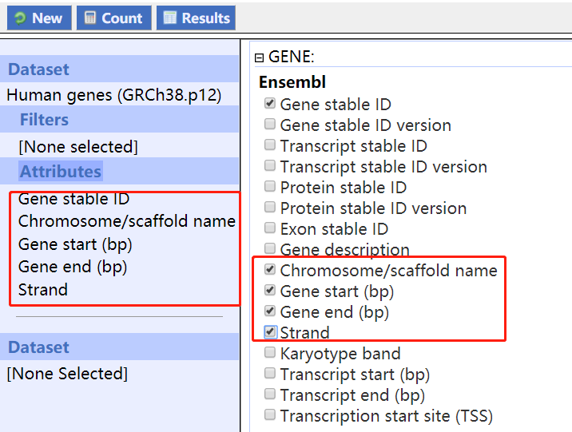

## How To

### Case 1: When you only have the foreground gene list, you want to extract FG and BG sequences, you can do the following:

1. Download the gene annotation file from BioMart
	- Gene name
	- Chromosome name
	- Gene Start
	- Gene End
	- Strand
	- Others (The rest coloumns will be ignored, but you can include them for other purposes. For example, a complete description of gene functions.)
	

2. Download the genome fasta file

3. Run `./promoter_retrieval.sh [BioMart_tsv] [Genome_fasta] [promoter_length] [foreground_gene_list]`

### Example commnad

`./promoter_retrieval.sh Brugia/Brugia_sequence_name.tsv Brugia/brugia_malayi.PRJNA10729.WBPS8.genomic.fa 1000 Brugia/sample_genes.list`

### Case 2: When you have gene lists for both FG and BG, the easiest way to extract promoter sequnences, is using BioMart. You can also modify my program to do that. [TODO]